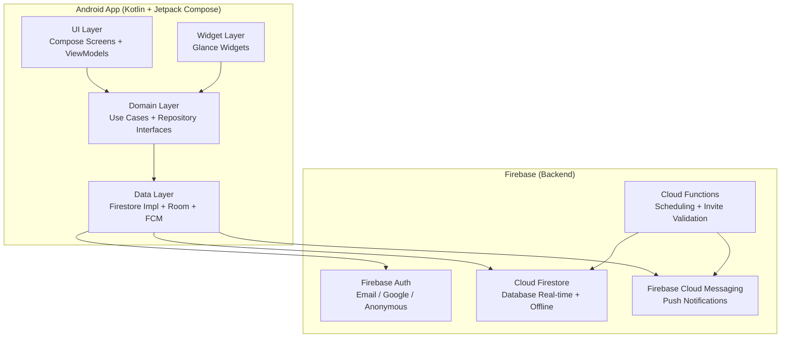

# Architettura — Carezze

## Diagramma di Sistema

## Flusso di una Richiesta Tipica (Quick Log pasto)

1. Utente tocca il FAB sulla Dashboard → apre Quick Log Bottom Sheet
2. `DashboardViewModel` chiama `LogActivityUseCase(personId, MealLog(...))`
3. `LogActivityUseCase` valida i dati e delega a `ActivityLogRepository`
4. `ActivityLogRepositoryImpl` scrive su **Room** (cache locale, operazione istantanea) + avvia scrittura asincrona su **Firestore**
5. Firestore snapshot listener riceve l'update → notifica tutti i `Membro` connessi in real-time (< 2s)
6. Se offline: Room mantiene il dato localmente; Firestore SDK accoda la scrittura e la sincronizza al ripristino della connessione

## Flusso Notifica Farmaco

1. **Cloud Function** schedulata legge le Terapie attive con `scheduledTimes` imminenti (finestra rolling)
2. Per ogni Farmaco non ancora confermato nel suo Orario Schedulato → crea un `MedicationLog` con `status=PENDING`
3. Invia notifica FCM a tutti i `fcmTokens` dei Membri della Terapia/Persona
4. Utente riceve notifica → apre l'app → conferma "Preso" → `MedicationLog.status = TAKEN`
5. Firestore aggiorna in real-time → tutti gli altri dispositivi vedono la conferma → notifica pendente rimossa

## Flusso Invito

1. Utente A genera Invito (tipo: `PERSON` o `THERAPY`, target: id)
2. Sistema crea documento `/invitations/{id}` con codice 8 char alfanumerico, scadenza 24h, `used=false`
3. Utente A condivide il codice/QR via WhatsApp o Telegram
4. Utente B inserisce il codice o scansiona il QR in app
5. **Cloud Function** verifica: codice valido, non scaduto, non usato → aggiunge `userId_B` come `EDITOR` in `persons/{id}.members` o `therapies/{id}.members` → aggiorna `users/{userId_B}.personAccess` o `therapyAccess` → marca invito `used=true`
6. Firestore propaga i nuovi permessi; Utente B vede immediatamente i dati condivisi

## Componenti

### UI Layer
- Compose Screens (stateless) alimentate da `StateFlow` esposti dai ViewModel
- Navigation gestita con Navigation Compose (graph dichiarativo)
- Nessuna logica di business nelle Screen — solo rendering e event forwarding

### Domain Layer
- **Use Cases**: un use case per azione utente significativa (es. `CreateTherapyUseCase`, `LogActivityUseCase`, `RedeemInvitationUseCase`)
- **Repository interfaces**: contratti puri Kotlin, nessuna dipendenza Android/Firebase
- **Domain models**: data class immutabili, sealed class per tipi polimorfici (`ActivityLog`, `TherapyDuration`)
- Testabile con JUnit5 + MockK puri (no Android SDK)

### Data Layer
- **FirestoreRepositoryImpl**: implementa le interface Domain, usa Firestore SDK con snapshot listeners → espone `Flow<T>`
- **RoomDatabase**: cache locale per offline-first; sincronizzazione bidirezionale con Firestore tramite WorkManager
- **FCMService**: gestisce ricezione notifiche, aggiornamento token, routing verso ViewModel

### Widget Layer
- **Glance Widgets**: 3 tipi (Terapia countdown, Pannolino quick-log, Pasto quick-log)
- Leggono da Room (cache locale) per velocità; scrivono tramite `ActivityLogRepository`

### Firebase Cloud Functions
- **scheduleNotifications**: cron ogni 5 min, controlla dosi imminenti
- **checkInactivity**: cron ogni 30 min, controlla log assenti oltre soglia configurata
- **redeemInvitation**: callable HTTPS, valida e applica l'invito atomicamente
- **onMemberRevoked**: Firestore trigger, cancella i dati dell'utente rimosso

## Decisioni Non Ovvie

- **Offline-first via Room**: Firestore ha cache offline nativa ma Room offre query più potenti e controllo esplicito; si usano entrambi con Room come source of truth locale
- **personAccess / therapyAccess su users/{id}**: array denormalizzati per permettere query `where('personAccess', 'array-contains', userId)` — necessario per il listing "tutti i profili a cui ho accesso"
- **Farmaci come array in Therapy**: evita sub-collection per dati che vengono sempre letti insieme; limite Firestore 1MB per documento è abbondante per N < 20 farmaci
- **Cloud Function per inviti**: la validazione lato client sarebbe bypassabile; la Function garantisce atomicità e sicurezza
