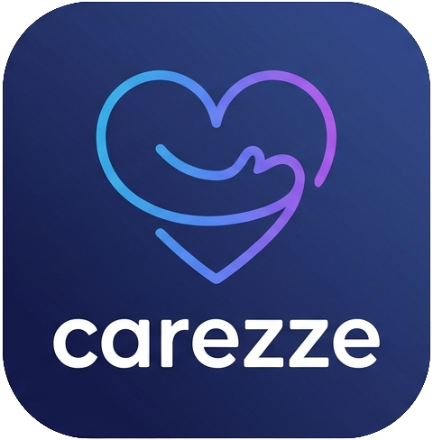

# Carezze
[](https://github.com/Fpculcasi/Carezze/actions/workflows/firebase-distribute.yml)

> *Carezze* means *caresses* in Italian — gentle, caring touches. It also starts with **Care**.

A mobile app for tracking medical therapies and neonatal parameters. Built for families, caregivers, and anyone managing ongoing health routines.

---

## Why This Exists

My daughter stopped breathing a few weeks after birth. We went to the emergency room in the middle of the night. She was admitted. The next morning, still in the hospital, doctors suggested a polysomnography to understand what had happened.

While we waited, they asked us: when did she last eat? How long had she been sleeping? Had she had any other episodes?

We had sticky notes in the kitchen and a Google Sheet we'd started and abandoned. We didn't have a clean log of the past 48 hours.

Carezze is the app I wished I had that night. It tracks therapies (medications, schedules, progress) and neonatal parameters (feeds, diapers, sleep, temperature) across everyone caring for the same person — in real time, privately, and **without requiring an account**.

---

## Core Principles

### No account required
You can use Carezze entirely offline, without signing up. Your data stays on your device. If you later decide to share with family or sync across devices, you register — and your existing data migrates automatically.

### Privacy by design
- Data stored in **Europe (Firebase `europe-west1`)** — GDPR compliant
- Sharing requires an **explicit single-use invite** (8-char code, 24h expiry)
- Revoking access **deletes** the other user's contributed data
- No analytics, no ads, no third-party data sharing

### Open source
Every architectural decision is visible in the code and documented in commit history. Fork it, contribute, or just read it.

---

## Features

**Implemented (v.x)**
- **Therapy management** — define multi-drug therapies with automatic dose scheduling; track progress as a bar, calendar, and remaining-dose counter; edit, terminate (soft), or delete (hard with cascade)
- **Activity logging** — meals (ml / minutes / grams), diapers, sleep intervals, temperature, weight, hygiene — all in 1 tap via Quick Log
- **Dashboard** — card view per person + chronological feed; filter by person, search by name
- **Real-time family sync** — Firestore snapshot listeners propagate every update across all shared devices instantly
- **Offline first** — Room as local source of truth; writes are fire-and-forget with a pending indicator and silent 3-attempt retry
- **Granular sharing** — share an entire person profile *or* just a single therapy (e.g. share the antibiotic schedule with the pediatrician, not the diaper log)

**Coming soon**
- **Push notifications** — medication reminders, inactivity alerts, family confirmation that dismisses on everyone's phone
- **Home screen widgets** — therapy countdown, diaper quick-log, meal quick-log — without opening the app
- **Multilingual** — Italian and English, switchable in-app

---

## Tech Stack

| Layer | Technology |
|---|---|
| Language | Kotlin 2.x |
| UI | Jetpack Compose |
| Architecture | MVVM + Clean Architecture (Use Cases, Repository pattern) |
| Local storage | Room (SQLite) |
| Remote database | Cloud Firestore (offline-first) |
| Authentication | Firebase Auth (Email, Google, Anonymous) |
| Push notifications | Firebase Cloud Messaging (planned — M7) |
| Dependency injection | Hilt |
| Background sync | WorkManager |
| Home screen widgets | Jetpack Glance (planned — M8) |
| Testing | JUnit 5 + MockK |
| CI/CD | GitHub Actions + Firebase App Distribution |
| Code quality | Detekt + Ktlint |

> No Cloud Functions — the app runs on Firebase Spark plan. Invite validation uses a client-side Firestore transaction; on-device scheduling uses WorkManager.

---

## Architecture

```
┌─────────────────────────────────────────────┐
│              Android App                     │
│  ┌──────────┐  ┌──────────┐  ┌───────────┐  │
│  │ UI Layer │  │  Domain  │  │   Data    │  │
│  │ Compose  │→ │Use Cases │→ │Firestore  │  │
│  │ViewModels│  │  Models  │  │  + Room   │  │
│  └──────────┘  └──────────┘  └───────────┘  │
│  ┌──────────┐                               │
│  │ Widgets  │  (Glance, reads from Room)    │
│  └──────────┘                               │
└─────────────────────────────────────────────┘
         │                    │
   Firebase Auth        Cloud Firestore
   (anonymous ok)       (europe-west1)
                              │
                    Firebase Cloud Messaging
                    (push to all shared devices)
```

The domain layer has **zero Android or Firebase dependencies** — all use cases and models are pure Kotlin, fully testable with JUnit 5 and MockK without an emulator.

---

## Data Model (Firestore)

```
users/{userId}
persons/{personId}
  └── therapies/{therapyId}
        └── medicationLogs/{logId}
  └── activityLogs/{logId}
invitations/{inviteId}
```

Sharing is enforced by a `members` map and a `memberIds` array on each `persons` and `therapies` document. Firestore Security Rules ensure users can only read and write documents they are explicitly listed in. Invite redemption is a client-side Firestore transaction — atomically validated and single-use.

---

## Getting Started

> ⚠️ Project is under active development. Setup instructions will be updated as the codebase grows.

### Prerequisites

- Android Studio Ladybug or later
- JDK 17+
- A Firebase project (Spark plan is sufficient — no Cloud Functions required)

### Setup

```bash
git clone https://github.com/your-username/carezze.git
cd carezze

# Copy the Firebase config (obtain from Firebase Console)
cp google-services.json.template app/google-services.json
# Fill in your Firebase project values
```

### Run

Open the project in Android Studio and run the `app` configuration on a device or emulator (API 26+).

### Test

```bash
./gradlew test              # Unit tests (JVM, no emulator needed)
./gradlew connectedTest     # Instrumented tests (requires emulator)
```

---

## Project Structure

```
carezze/
├── app/
│   └── src/
│       ├── main/kotlin/com/fpculcasi/carezze/
│       │   ├── data/         # Repository implementations, Firestore, Room
│       │   ├── domain/       # Models, Use Cases, Repository interfaces
│       │   ├── ui/           # Compose screens and ViewModels
│       │   └── widget/       # Glance widgets (planned)
│       └── test/ + androidTest/
├── firestore.rules           # Firestore Security Rules
└── .github/workflows/        # GitHub Actions CI + Firebase App Distribution
```

---

## Branching Strategy

This project follows **GitFlow**:

| Branch | Purpose |
|---|---|
| `main` | Production-ready releases only |
| `develop` | Integration branch for completed features |
| `feature/X` | Individual features |
| `release/X.Y` | Release preparation |
| `hotfix/X` | Critical fixes on main |

AI agents working on this project use worktrees with branch naming `bma/X.Y` (one per task), merged into `develop` via PR.

---

## Roadmap

**v1.0**
- [x] Project design and architecture
- [x] Android project setup + CI/CD (GitHub Actions, Firebase App Distribution)
- [x] Authentication — anonymous (no account needed), email/password, Google Sign-In, seamless data migration
- [x] Person management — CRUD, real-time sync, color coding per person
- [x] Therapy management — multi-drug schedules, progress tracking, edit / terminate / delete, manual dose log
- [x] Activity logging and dashboard — all event types, Quick Log, 30-day history (list + calendar), offline-first with pending indicator
- [ ] Family sharing and invitations — QR + 8-char code, single-use with 24h expiry, member management, revocation with cascade *(in progress)*
- [ ] Push notifications (FCM) — medication reminders, inactivity alerts, family dose confirmation
- [ ] Home screen widgets (Glance) — therapy countdown, diaper, meal
- [ ] Italian / English localization

**Future**
- iOS support
- Data export (PDF / CSV)
- Dark mode
- Onboarding wizard
- Additional languages

---

## Development Blog

This project is documented publicly as it's built:

| Post | Topic | Status |
|---|---|---|
| [#1 — The Idea](https://medium.com/@fpculcasi/i-had-a-daughter-i-built-an-app-f8bc76cf78ad) | Why Carezze exists, the Firestore schema, architecture decisions | published |
| #2 — Foundations | Firebase, offline-first, anonymous auth | planned |
| #3 — Core Features | Therapies, neonatal logging, TDD in practice | planned |
| #4 — Sharing & Security | Real-time sync, invite system, Firestore rules | planned |
| #5 — Launch & Retrospective | Widgets, AI-assisted development, lessons learned | planned |

---

## Contributing

Contributions are welcome. Please open an issue before submitting a PR so we can discuss the approach.

1. Fork the repo
2. Create a feature branch (`git checkout -b feature/your-idea`)
3. Commit with clear messages
4. Open a pull request against `develop`

---

## License

[MIT](LICENSE)

---

*Built by a parent who needed it. Open to anyone who does.*
